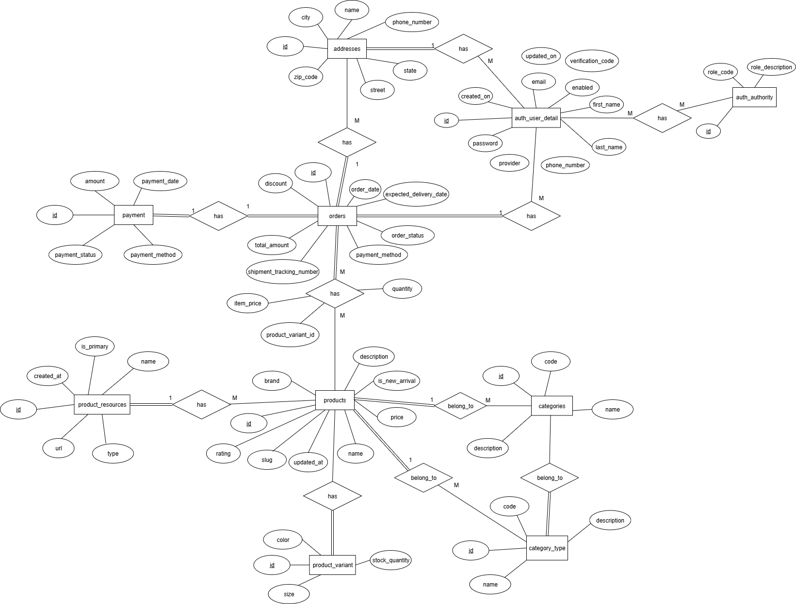
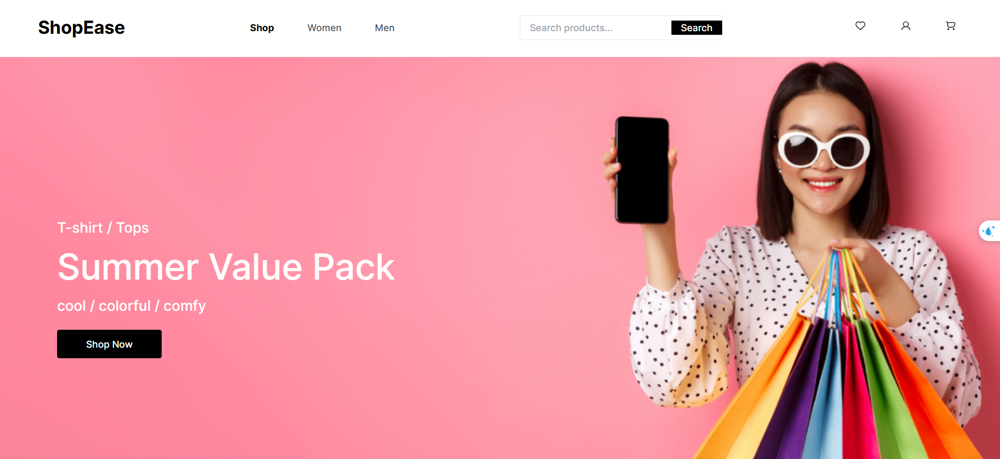
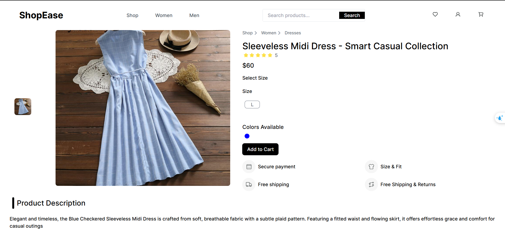
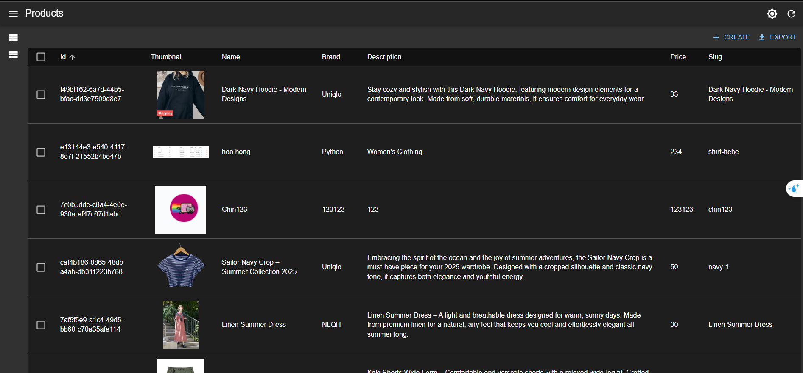

# 🛍️ ShopEase E-Commerce Platform


---

## 📚 Table of Contents

1. [Overview](#-overview)  
2. [Features (Modules)](#-features-modules)  
3. [Project Structure](#-project-structure)  
4. [ERD Diagram](#-erd-diagram)  
5. [Technology Stack](#-technology-stack)  
6. [Getting Started](#-getting-started)  
7. [CI/CD Workflow](#-cicd-workflow)  
8. [Future Enhancements](#-future-enhancements)  
9. [Contributors](#-contributors)  
10. [Screenshots](#-screenshots)  
11. [License](#-license)

---

## 🧭 Overview

**ShopEase** is a full-featured **E-Commerce Platform** built with **React** (frontend), **Spring Boot** (backend), and **PostgreSQL** (database). The project is fully **Dockerized** and integrates **GitHub Actions** for CI/CD to automate building, testing, and deployment.

Key capabilities:
- User authentication (JWT + OAuth2)
- Product & category management
- Cart, checkout, and order processing
- Admin panel for CRUD and analytics-ready endpoints
- Static assets served via CDN (Bunny.net integration)

---

## 🚀 Features (Modules)

### 👤 Authentication & User Management
- Register / Login (JWT)
- Google OAuth2 sign-in
- Profile, addresses, order history

### 🛒 Product & Category
- Product CRUD with variants & resources (images)
- Category & CategoryType management
- Product filters: price, size, color, category

### 💳 Cart & Checkout
- Client-side cart management
- Quantity update, subtotal calculation
- Mock payment flow / webhook simulation

### 📦 Order Management
- Order lifecycle: Pending → Confirmed → Shipped → Delivered
- Order items, totals, and payment records
- Order timeline for users and admins

### 🧑‍💼 Admin Panel
- Product/category management UI
- Order list & status updates
- Simple product statistics

---

## 🧱 Project Structure

```
KTMP_ShopEase/
├── UI/                           # Frontend (React)
│   ├── public/
│   ├── src/
│   │   ├── api/
│   │   ├── assets/
│   │   ├── components/
│   │   ├── pages/
│   │   ├── store/
│   │   └── index.js
│   ├── dockerfile
│   ├── nginx.conf
│   └── package.json
|
├── backend/                      # Backend (Spring Boot)
│   ├── controller/
│   ├── dto/
│   ├── entity/
│   ├── repository/
│   ├── service/
│   ├── mapper/
│   ├── configuration/
│   └── ShopeaseApplication.java
|
├── database/
│   ├── dockerfile
│   ├── backup.sql
│   └── neondb.backup
|
├── docker-compose.yml
├── .github/
│   └── workflows/
│       └── cicd.yml
├── shopEase.postman_collection.json
└── README.md
```

---

## 🧩 ERD Diagram




---

## 🧰 Technology Stack

| Layer | Technology | Description |
|-------|------------|-------------|
| **Frontend** | ReactJS, Redux Toolkit, TailwindCSS | SPA with modular components & state management |
| **Backend**  | Spring Boot 3, JPA, Swagger | REST API, business logic, API docs |
| **Database** | PostgreSQL 17 | Relational storage with migrations/backup |
| **Storage/CDN** | Bunny.net | Host static product images |
| **Containerization** | Docker, Docker Compose | Local dev & production images |
| **CI/CD** | GitHub Actions | Build, test, push, deploy pipeline |
| **Testing** | JUnit, Postman | Unit & integration testing |

---

## ⚙️ Getting Started

### 1️⃣ Clone the repository
```bash
git clone https://github.com/<your-username>/KTMP_ShopEase.git
cd KTMP_ShopEase
```

### 2️⃣ Setup environment variables
Create `.env` for backend (example):
```bash
# .env (backend)
DB_HOST=postgres
DB_PORT=5432
DB_NAME=shopease
DB_USER=postgres
DB_PASSWORD=123456
CDN_HOST=https://your-bunny-cdn.net/
SPRING_JPA_HIBERNATE_DDL_AUTO=update
JWT_SECRET=your_jwt_secret_here
```

Frontend environment (.env or .env.local):
```bash
REACT_APP_API_BASE_URL=http://localhost:8080/api
REACT_APP_CDN_HOST=https://your-bunny-cdn.net/
```

### 3️⃣ Build & run with Docker Compose
```bash
docker-compose up --build
```

Services after up:
- Frontend → `http://localhost:3000`  
- Backend API → `http://localhost:8080`  
- PostgreSQL → `localhost:5432`

### 4️⃣ API docs (Swagger)
Open: `http://localhost:8080/swagger-ui/index.html`

---

## 🔁 CI/CD Workflow

The provided GitHub Actions workflow (`.github/workflows/cicd.yml`) should include steps to:

1. Checkout code  
2. Set up Java / Node environments  
3. Run tests (unit/integration)  
4. Build Docker images for `frontend` & `backend`  
5. Push images to Docker Hub (e.g., `chin2109/shopease_frontend`, `chin2109/shopease_backend`)  
6. Optionally deploy to hosting (DigitalOcean, VPS, or other)

**Tips**
- Store Docker Hub credentials and other secrets in GitHub Secrets.  
- Keep builds incremental and cache dependencies where possible.

---

## 🧠 Future Enhancements

- Integrate real payment gateways (VNPay, Stripe)  
- Add analytics dashboard (sales, users, conversions)  
- Full test coverage and CI gating (coverage thresholds)  
- Add blue/green or rolling deployment strategy  
- Add Redis for caching and session acceleration  
- Add image optimization pipeline and automated CDN invalidation

---

## 👨‍💻 Contributors

| Name | Role | Description |
|------|------|-------------|
| **Chin** | Fullstack Developer | Implemented frontend, backend, and CI/CD |
| **Mentor / Instructor** | Supervisor | Technical guidance and code review |

---

## 🖼️ Screenshots

| Home Page | Product Detail | Admin Panel |
|-----------|----------------|-------------|
|  |  |  |

---

## 📄 License

This project is licensed under the [MIT License](LICENSE). Learn more at [choosealicense.com](https://choosealicense.com/licenses/mit/).

